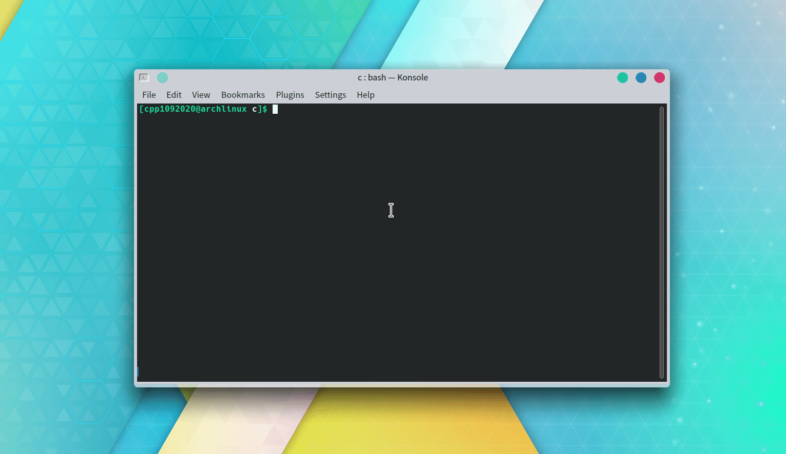

# Shared_Memory
### 測試環境
* Arch Linux KDE

### C Language
#### setup.sh
* 把 `p1.c` 與 `p2.c` 自動編譯成 `p1` 與 `p2`

### p1
* 自動產生兩個 `1 ~ 100` 的整數亂數並寫入 `data`（`shared_memory`）
* `fork()` 到 `p2` 做運算
* 讀 `data` 拿到運算結果
* 等待三秒執行下一次運算
* 函式
	* `char* intToCharArray(int a, int b)`
		- 把兩個整數轉換成 `char array`
	* `void forkToChild(pid_t pid)`
		- 判斷 `fork()` 有沒有成功
	* `void charArrayToInt(char arr[], int *number)`
		- 把 `char array` 轉換成整數形態

### p2
* 讀取 `data` 的資料並做運算，且等待一秒
* 寫入 `data` 且等待一秒
* 函式
	* `char* intToCharArray(int number)`
		- 把整數轉換成 `char array`
	* `void charArrayToInt(char arr[], int *a, int *b)`
		- 把 `char array` 轉換成兩個整數

### Demo
* 只要執行 `p1` 就好了

